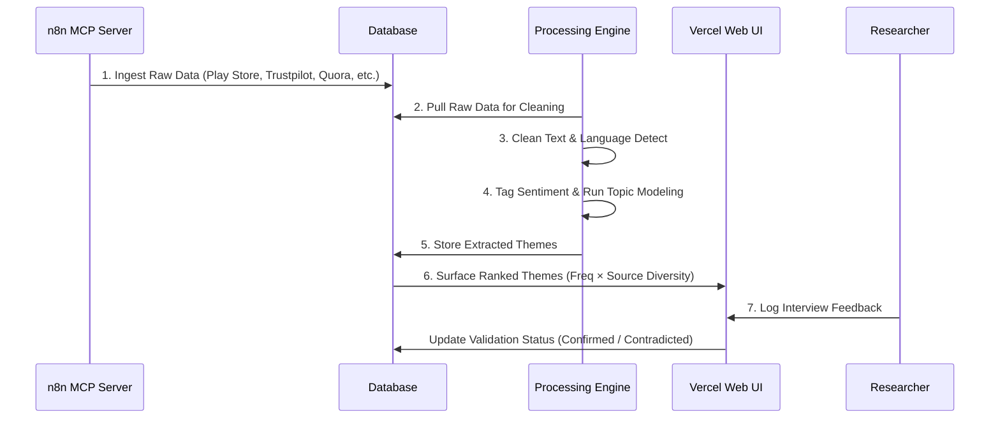

# Detailed Architecture: Blinkit Review Analyzer

This document provides the detailed software architecture, pipeline design, data schemas, and component descriptions for the **Blinkit Review Analyzer**, derived from the requirements in [problemStatement.md](file:///E:/blinkit-review-analyzer/problemStatement.md).

---

## 1. Architectural Overview

The Blinkit Review Analyzer is designed as a modular system consisting of an **Ingestion Pipeline** (orchestrated via an n8n MCP Server), a **Processing & Analytics Engine** (for NLP and aspect-based sentiment analysis), and a **Dashboard UI** (to view insights and record primary research validation).

```mermaid
graph TB
    subgraph Data Sources
        DS1[Play Store & App Store]
        DS2[Trustpilot & MouthShut]
        DS3[Quora & Reddit]
        DS4[Social Media & Forums]
    end

    subgraph Ingestion Layer (MCP / n8n)
        N8N[n8n Workflow: h7hGpQhZBPsHDy58]
        WebScrapers[Play/App Store Scrapers]
        APIConnectors[Reddit/Custom APIs]
    end

    subgraph Storage Layer
        DB[(SQLite Database)]
        T_Raw[raw_reviews Table]
        T_Themes[extracted_themes Table]
        T_Insights[validated_insights Table]
    end

    subgraph Processing Layer (NLP / LLM)
        NLP[Cleaning & Filter Engine]
        Sentiment[Sentiment Scorer]
        Taxonomy[Theme Extractor]
    end

    subgraph Client Layer
        WebUI[Vercel Web UI]
        API[FastAPI Backend]
    end

    %% Flow lines
    DS1 & DS2 & DS3 & DS4 --> N8N
    N8N --> WebScrapers & APIConnectors
    WebScrapers & APIConnectors --> DB
    DB --> T_Raw
    T_Raw --> NLP
    NLP --> Sentiment --> Taxonomy
    Taxonomy --> T_Themes
    T_Themes --> T_Insights
    T_Insights & T_Themes & T_Raw --> API
    API --> WebUI
```

---

## 2. Component Specifications

### 2.1 Ingestion Layer (n8n MCP Server)
The entry point for data is the custom n8n workflow located at `https://nikiagape.app.n8n.cloud/workflow/h7hGpQhZBPsHDy58`.
* **Role**: Acts as the centralized pipeline orchestrator and Model Context Protocol (MCP) host.
* **Scraping Strategy**:
  * **Play/App Store**: Fetches star-rated feedback periodically using public review scrapers.
  * **Trustpilot / MouthShut**: Periodically executes HTML scrapers targeting Blinkit-specific profile pages.
  * **Quora / Reddit**: Polls active threads matching quick-commerce and category-specific keywords (e.g., `r/blinkit`, `r/india`, specific search queries).
* **Metadata Normalization**: Normalizes all incoming text payloads into a standard JSON schema before database ingestion.

### 2.2 Storage Layer (Database Schema)
The system uses a relational SQLite database to store raw and processed structures.

#### Table: `raw_reviews`
Stores normalized review entries from all ingestion channels.

| Column | Type | Description |
| :--- | :--- | :--- |
| `id` | UUID (PK) | Unique identifier for each entry |
| `source` | VARCHAR | Source identifier (e.g., `play_store`, `trustpilot`, `quora`) |
| `rating` | INT (Nullable) | Star rating / upvotes |
| `review_text` | TEXT | Raw review content (English/Hinglish) |
| `timestamp` | TIMESTAMP | Date-time of the review publication |
| `app_version` | VARCHAR (Nullable) | Software version associated with the review (for app stores) |
| `raw_payload` | JSONB | Complete original payload (for audit trail) |

#### Table: `extracted_themes`
Stores themes extracted from processing runs.

| Column | Type | Description |
| :--- | :--- | :--- |
| `id` | SERIAL (PK) | Primary key |
| `review_id` | UUID (FK) | Reference to `raw_reviews.id` |
| `theme_tag` | VARCHAR | Mapped taxonomy tag (e.g., `trust deficit`, `quality doubt`) |
| `sentiment_score`| FLOAT | Range from -1.0 (highly negative) to +1.0 (highly positive) |
| `sentence_extract`| TEXT | Specific snippet representing the theme |

#### Table: `validated_insights`
Maintains the running validated insight log corresponding to primary-research interview confirmations.

| Column | Type | Description |
| :--- | :--- | :--- |
| `id` | SERIAL (PK) | Primary key |
| `theme_tag` | VARCHAR | Extracted theme tag |
| `insight_statement` | TEXT | Summarized user-facing insight statement |
| `validation_status`| VARCHAR | `Confirmed` \| `Partially Confirmed` \| `Contradicted` \| `New Finding` |
| `interview_quotes` | JSONB | Array of paraphrased/verbatim quotes from 5-6 interview subjects |
| `last_updated` | TIMESTAMP | Last modification timestamp |

#### 2.4 Groq LLM & API Integration
The summarization and verification stages utilize the Groq API:
* **Model**: `llama-3.1-8b-instant`
* **API Key**: `[REDACTED_FOR_SECURITY]`
* **Rate Limits**:
  * Requests per Minute (RPM): 30
  * Requests per Day (RPD): 14.4k
  * Tokens per Minute (TPM): 6k
  * Tokens per Day (TPD): 500k

---

## 3. Analysis Pipeline (7-Stage Process Flow)

The data flows through the analysis pipeline as detailed below:



### 3.1 Stage-by-Stage Implementation Details

1. **Ingest**: The n8n workflow executes scheduled runs to fetch reviews. It dedupes incoming items against a hash of `(source, review_text, timestamp)`. Saves all raw reviews to `raw_reviews.json`.
2. **Clean & Filter**:
   * Apply strict normalization rules: discard reviews containing **fewer than 5 words**, containing **any emojis**, or written in **non-Latin scripts** (e.g., Devanagari Hindi, Cyrillic, Tamil) to filter out noise.
   * Strip metadata fields: remove `reviewed`, `userName`, `userImage`, `reviewCreated Version`, `at`, `replyContent`, and `replied At` keys from payloads.
   * Save the filtered reviews to `normalized_reviews.json`.
   * Preserves **transliterated Hinglish** expressions (e.g., *"quality kharab hai"*, *"late delivery"*) written in Latin characters.
3. **Sentiment Tagging**:
   * Perform sentence-level segmentation.
   * Run sentiment scoring using fine-tuned models (e.g., VADER/lexicon-based models optimized for English/Hinglish text).
4. **Theme Extraction**:
   * **Taxonomy-based Tagging (Primary)**: Map sentences against the predefined keyword-anchored taxonomy (e.g., `quality doubt`, `trust deficit`) using our custom lexicon matcher.
   * **Unsupervised Modeling**: Extract recurring multi-word phrases using **N-Gram Frequency Mining** directly. Do **NOT** use TF-IDF vectorization for clustering due to script/language vocabulary sparsity. If high-level clustering is needed, use **Multilingual Semantic Embeddings** (e.g., Gemini `text-embedding-004` or a pre-trained local `SentenceTransformer`).
5. **Clustering & Triangulation**:
   * Calculate a **Source Diversity Score** for each theme ($D = \text{Count of unique sources with theme}$).
   * Weight and rank themes by:
     $$\text{Rank Score} = \text{Frequency} \times \text{Source Diversity}$$
   * Flag any theme appearing in $\ge 3$ sources as high-confidence.
6. **Insight Synthesis**:
   * Generate an insight brief summarizing high-confidence themes.
   * Extract 2-3 illustrative paraphrased quotes from the corpus.
7. **Human Validation (Primary Research)**:
   * Provide an interactive UI form in the Dashboard where researchers connect user interview results to specific AI-surfaced insights.
   * Classify insights to output a finalized **Validated Insight Log**.

---

## 4. UI Dashboard Requirements

The frontend interface (built using React / Next.js and deployed on Vercel) must expose the following panels:
* **Ingestion Overview**: Displays database metrics, distribution of review counts across the 6 sources, and ingestion status logs.
* **Theme Explorer**: 
  * A table showing extracted themes ranked by (Frequency $\times$ Source Diversity).
  * Filter criteria: Date, Source type, Sentiment, and Research Question.
  * Card-view displaying paraphrased quotes for selected themes.
* **Validation Workspace**:
  * An editing pane allowing the researcher to map 5-6 customer interview transcripts against the AI-generated insights.
  * Inputs to toggle validation state (`Confirmed`, `Partially Confirmed`, `Contradicted`, `New Finding`) and add supporting quotes.
* **Problem Statement Exporter**: A component that formats the validated high-confidence insights directly into a draft problem statement matching the template defined in `problemStatement.md`.
