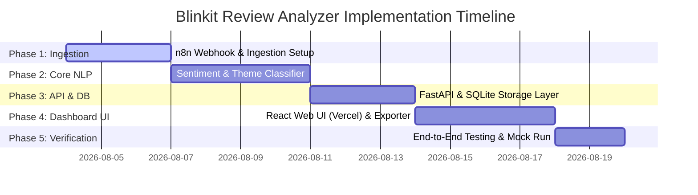

# Implementation Plan: Blinkit Review Analyzer

This document maps out the phase-wise implementation plan for building the **Blinkit Review Analyzer** based on [problemStatement.md](file:///E:/blinkit-review-analyzer/problemStatement.md) and [architecture.md](file:///E:/blinkit-review-analyzer/architecture.md).

---

## Goal Description
Build a Review Analyzer system for Blinkit to help researchers discover why customers are hesitant to explore new categories. The tool will ingest reviews from Play Store, App Store, Trustpilot, and Quora (via an n8n MCP Server webhook), perform sentiment/theme analysis mapping to a specific research taxonomy, and enable manual validation of insights via a React dashboard deployed on Vercel.

---

## Project Decisions & Parameters
* **Database**: SQLite database (configured in Write-Ahead Logging (WAL) mode and with a busy timeout of 5000ms to handle concurrent dashboard reads and pipeline writes).
* **MCP / n8n Authentication**: No authorization headers are required to communicate with the n8n webhook workflow (`https://nikiagape.app.n8n.cloud/workflow/h7hGpQhZBPsHDy58`).
* **Groq LLM Configuration**:
  * **Model**: `llama-3.1-8b-instant`
  * **API Key**: `[REDACTED_FOR_SECURITY]`
  * **Rate Limits**:
    * Requests per Minute (RPM): 30
    * Requests per Day (RPD): 14.4k
    * Tokens per Minute (TPM): 6k
    * Tokens per Day (TPD): 500k

---

## Proposed Phases

---

## Phase 1: Ingestion & n8n Integration
* **Objective**: Configure raw reviews ingestion from the targeted platforms via the n8n MCP Server.
* **Tasks**:
  1. Create a script/connector to request reviews from the n8n webhook URL.
  2. Implement scraping fallback handlers for Google Play Store and Apple App Store.
  3. Set up ingestion parsers for Trustpilot reviews and Quora thread responses containing keyword mentions.
  4. Write a deduplication utility that hashes `(source, review_text, timestamp)`.

---

## Phase 2: Processing & NLP Engine
* **Objective**: Develop the processing pipeline to clean text, tag sentiment, and classify themes.
* **Tasks**:
  1. Build a text-cleaning pipeline that retains Hinglish transliterated words (e.g., *“kharab”*, *“deri”*, *“late”*).
  2. Configure sentence-level sentiment scoring (Positive, Neutral, Negative) using VADER or Hugging Face.
  3. Implement taxonomy-based theme classification matching the key research questions:
     * `habit/convenience`
     * `quality doubt`
     * `trust deficit`
     * `price sensitivity`
     * etc.
  4. Integrate unsupervised topic modeling to detect themes not caught by the keyword taxonomy:
     * *Lightweight Local Approach*: Use **N-Gram Frequency Mining** (as implemented in `nlp_engine.py`) to extract recurring multi-word phrases directly, bypassing vectorization issues.
     * *Clustering Rules*: **Do NOT use TF-IDF vectorization for clustering** (it fails on Hinglish spelling variations and script mismatches like Devanagari vs. Latin). If clustering is required, rely on **Multilingual Semantic Embeddings** (e.g., Gemini `text-embedding-004` or a pre-trained local `SentenceTransformer`).

---

## Phase 3: DB & Storage Layer
* **Objective**: Implement database schemas and build backend API endpoints.
* **Tasks**:
  1. Initialize database tables for `raw_reviews`, `extracted_themes`, and `validated_insights` (defined in [architecture.md](file:///E:/blinkit-review-analyzer/architecture.md)).
  2. Write CRUD models using SQLAlchemy / SQLModel.
  3. Expose backend API routes using FastAPI:
     * `GET /api/reviews` (fetch reviews with pagination & filters)
     * `GET /api/themes` (fetch themes ranked by frequency $\times$ source diversity)
     * `POST /api/insights/validate` (log or update interview validation status)
     * `GET /api/problem-statement/export` (export formatted problem statement draft)

---

## Phase 4: React Dashboard UI (Vercel)
* **Objective**: Build the visual workspace for researchers.
* **Tasks**:
  1. Create the dashboard layout with tabs for **Overview**, **Theme Explorer**, and **Validation Workspace**.
  2. In **Theme Explorer**, render the ranked theme tables with interactive filters (Date, Source, Sentiment).
  3. In **Validation Workspace**, implement forms for researchers to input 5-6 interview summaries, match them to AI insights, and toggle validation status (`Confirmed`, `Partially Confirmed`, `Contradicted`, `New Finding`).
  4. Implement the problem-statement export panel, displaying the prefilled template in Markdown.

---

## Phase 5: Verification & Validation
* **Objective**: Test and verify the end-to-end flow with sample data.
* **Tasks**:
  1. Ingest a mock dataset containing 100 sample reviews representing various complaints and praises.
  2. Verify that the clustering calculates the Frequency $\times$ Source Diversity metric correctly.
  3. Simulate primary research verification by logging mock interviews.
  4. Run code quality checks, linter checks, and check connection robustness to n8n.

---

## Verification Plan

### Automated Tests
* Ingest validator tests: `pytest tests/test_ingestion.py`
* NLP classifier accuracy tests: `pytest tests/test_nlp.py`
* Database operations and endpoints tests: `pytest tests/test_api.py`

### Manual Verification
1. Run the FastAPI backend: `uvicorn main:app --reload`
2. Run the React frontend locally (`npm run dev`) and test Vercel serverless functions / preview deployments.
3. Trigger a manual sync with the n8n workspace, verifying reviews are correctly populated in the database.
4. Input a test validation entry, verify the database records it, and export the problem statement draft.
