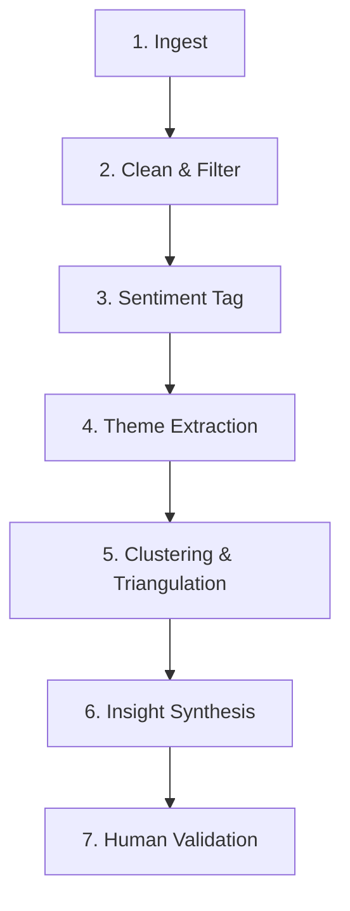

# Problem Statement & Discovery Engine Context: Blinkit Review Analyzer

This document defines the problem statement, context, and requirements for the **Blinkit Review Analyzer** (a tool designed to understand why quick-commerce users don't explore new categories, built specifically for the **Blinkit** platform).

---

## 1. Background
Quick-commerce platforms are deeply integrated into users' weekly routines. For this project, we are focusing exclusively on the **Blinkit** platform. Recurring orders on Blinkit are heavily concentrated in a few categories:
* Groceries
* Snacks & beverages
* Household essentials

Over time, this convenience results in **repetitive ordering behavior**, where users purchase the same subset of products and rarely explore alternative categories offered by the platform.

### Strategic Goal
> [!IMPORTANT]
> **Strategic Goal**: Increase the percentage of Monthly Active Customers (MACs) who purchase from at least one new category every month on Blinkit.

This document defines the **discovery engine** (an AI-assisted analysis pipeline over public online discussions) and the primary-research validation plan required to build a working "review analyzer" tool.

---

## 2. Discovery Engine — Data Sources
The engine is built specifically for **Blinkit**, capturing feedback **strictly from actual customers or users of the platform**. It is fed by reviews and feedback from different platforms (such as Google Play Store reviews, Apple App Store reviews, Trustpilot, Quora, and other related community forums/platforms) found via the target search query:
* [Blinkit Reviews Search Query Link](https://www.google.com/search?q=blinkit+reviews&oq=blinkit+reviews+&gs_lcrp=EgZjaHJvbWUqCggAEEUYFhgeGDsyCggAEEUYFhgeGDsyBwgBEAAYgAQyBwgCEAAYgAQyBwgDEAAYgAQyBwgEEAAYgAQyCAgFEAAYFhgeMggIBhAAGBYYHjIICAcQABgWGB4yCAgIEAAYFhgeMggICRAAGBYYHtIBCTQzOTNqMGoxNagCCLACAfEFkxkopDysmjo&sourceid=chrome&source=chrome.rb&ie=UTF-8)

The data sources include:

| Source | What it surfaces | Collection Approach |
| :--- | :--- | :--- |
| **App Store / Play Store reviews** | Star-rated feedback tied to specific app versions; feature-level complaints and praise | Public review APIs / scraping by Blinkit App ID on a rolling window; tagged with rating + version |
| **Review Platforms** (e.g., Trustpilot, MouthShut) | In-depth customer reviews and ratings detailing user experience, delivery quality, and customer support | Scraped from dedicated Blinkit company/review pages on a rolling window |
| **Q&A & Discussion Forums** (e.g., Quora, Reddit) | Unfiltered customer questions, detailed user experiences, habit talk, comparison threads, and "why I stopped using X" posts | Scraping relevant Quora topics/threads and subreddit search via Reddit API (PRAW), pulling comment threads for context |
| **Community forums** (local, parenting, personal finance) | Category-specific need discussions (e.g., baby care, pet care) not tied to any one platform | Targeted forum search by category keywords; manual curation of relevant threads |
| **Social media** (X/Twitter, Instagram, Facebook groups) | Real-time frustration/praise, viral complaints, influencer-driven category discovery | Hashtag + brand-mention search, public post scraping within platform ToS |
| **Product reviews** (on-platform, marketplace) | Category-specific trust signals (e.g., quality doubts, packaging, authenticity concerns) | Scraped per product/category page; paired with star rating and verified-purchase flag |
| **Quick-commerce threads** (comparison blogs, YouTube comments) | Cross-platform comparisons, feature requests, and discovery-channel mentions | Targeted search + comment scraping on comparison content |

---

## 3. Analysis Workflow
The pipeline processes raw data through seven distinct stages to produce a validated insight log:

### Stage Details

1. **Ingest**
   * *Process*: Pull raw text from all seven sources on a rolling window; store with metadata (source, date, rating/upvotes, platform).
   * *Output*: Deduplicated raw corpus.
2. **Clean & Filter**
   * *Process*: Language detection (retaining English + transliterated Hinglish), strip spam/bot content, and remove non-review noise.
   * *Output*: Cleaned corpus.
3. **Sentiment Tag**
   * *Process*: Sentence-level sentiment scoring (positive/negative/neutral) per post.
   * *Output*: Sentiment-tagged corpus.
4. **Theme Extraction**
   * *Process*: Topic modeling (e.g., BERTopic/LDA) plus a keyword-anchored taxonomy to identify recurring themes per research question.
   * *Output*: Theme-tagged corpus and theme frequency counts.
5. **Clustering & Triangulation**
   * *Process*: Group similar mentions across sources; weight by frequency $\times$ sentiment intensity; flag themes appearing in $\ge 3$ sources as higher-confidence.
   * *Output*: Ranked theme list with source diversity scores.
6. **Insight Synthesis**
   * *Process*: Write a one-line insight for each high-confidence theme, accompanied by 2–3 illustrative (paraphrased) quotes and the affected segment (where inferable).
   * *Output*: Insight brief per theme.
7. **Human Validation**
   * *Process*: Primary research (interviews) to cross-check each insight.
   * *Output*: Validated insight log (categorized as: confirmed, partially confirmed, contradicted, or new-finding).

---

## 4. Theme Identification & Taxonomy
Unsupervised topic modeling runs in parallel with a keyword-anchored taxonomy mapped directly to the guiding research questions:

| Research Question | Theme Tags to Extract |
| :--- | :--- |
| *Why do users repeatedly buy the same categories?* | `habit/convenience`, `time-saving`, `autopilot ordering`, `loyalty to known brands` |
| *What prevents exploration of new categories?* | `quality doubt`, `price sensitivity`, `no felt need`, `trust deficit`, `unfamiliarity` |
| *How do users discover products today?* | `recommendation module`, `search`, `influencer/social mention`, `word of mouth`, `banner/ad` |
| *What role do habits play?* | `repeat-cart`, `saved lists`, `subscription/reorder behavior`, `routine framing` |
| *What info do users need before trying a new category?* | `reviews`, `brand recognition`, `return policy`, `sample/trial availability`, `price transparency` |
| *What frustrations emerge repeatedly?* | `irrelevant recommendations`, `poor search`, `delivery/quality issues`, `dark patterns` |
| *Which segments are more likely to experiment?* | `life-stage triggers` (new parent, pet, relocation), `deal-seekers`, `high app-usage frequency` |
| *What unmet needs emerge consistently?* | `category gaps`, `bundle requests`, `verification/authenticity asks`, `subscription flexibility` |

---

## 5. Insight Generation
For each theme, the engine produces an insight brief containing:
1. **One-Line Insight** (e.g., *"Users avoid new categories primarily due to unverified product quality, not price"*).
2. **Frequency & Source Diversity** (how widespread the pattern is across distinct sources).
3. **Sentiment Profile** (complaint, request, or neutral description).
4. **Illustrative Mentions** (2–3 paraphrased customer quotes).
5. **Target Segment** (where inferable, e.g., new parents).

> [!TIP]
> Themes are ranked by **(Frequency $\times$ Source Diversity)** to prioritize broad, cross-cutting patterns over isolated complaints.

---

## 6. Primary Research Validation
AI-surfaced themes are hypotheses that must be validated via **5–6 interviews** with the target customer segment.

### 6.1 Segment Selection
Focus interviews on a specific segment experiencing a life-stage trigger (e.g., grocery/household-essentials buyers who recently had a baby, got a pet, or relocated).

### 6.2 Interview Guide Areas
* **Warm-up / Habits**: Walkthrough of recent orders.
* **Habit & Repetition**: Reasons for reordering the same items.
* **Barriers to Exploration**: Categories considered but not purchased.
* **Discovery**: App-based or external discovery channels.
* **Trust & Information Needs**: Requirements before buying unfamiliar items.
* **Frustrations**: Unhelpful or irrelevant recommendations.
* **Triggers**: Household changes impacting shopping.
* **Workarounds**: Alternatives used instead of the app (e.g., competitor apps, offline stores).

### 6.3 Validation Logic
* **Confirmed** ($\ge 4$ of 5–6 interviewees agree): Treat as a core, evidence-backed input to the problem statement.
* **Partially Confirmed** (some echo, but with different causes/conditions): Refine insight scope/segment.
* **Contradicted** (interviewees describe the opposite): Flag as online bias; drop or heavily caveat.
* **New Finding** (not surfaced by AI): Add to the primary-research insight log.

---

## 7. Problem Statement Template
Frame the finalized problem statement using this structure:

| Element | Guiding Question to Answer |
| :--- | :--- |
| **Target User Segment** | Who specifically is affected (defined by behavior/life-stage, not demographics)? |
| **Root Cause** | What is the deepest reason exploration doesn't happen (trust deficit, unawareness, etc.)? |
| **Existing Workarounds** | What do users do instead today (other apps, offline stores, ignoring the need)? |
| **User Value** | What does solving this save the user (time, money, risk, mental effort)? |
| **Business Value** | How does this drive retention, basket size, category penetration, or CAC efficiency? |

---

## 8. Review Analyzer Tool Requirements
To automate this workflow, the tool must support:
* **Ingest & Tag**: Load raw text from the 7 source types with consistent metadata (source, date, rating, platform).
* **Process**: Clean corpus, run sentiment scoring, and extract themes using the taxonomy.
* **Visualize**: Render a filterable theme list showing frequency, sentiment, and source diversity.
* **Illustrate**: Show paraphrased examples per theme with source attribution.
* **Validate Log**: Track interview findings and assign `confirmed`/`partial`/`contradicted`/`new` tags to AI-surfaced themes.
* **Export**: Export a pre-filled problem-statement draft based on validated high-confidence insights.
* **MCP Integration**: Connect directly to the custom [n8n MCP Server Workflow](https://nikiagape.app.n8n.cloud/workflow/h7hGpQhZBPsHDy58) to execute data collection queries and retrieve formatted payloads dynamically.

