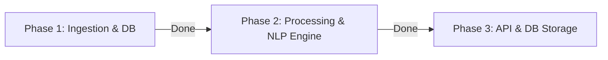

# Walkthrough: Blinkit Review Analyzer Progress

This document summarizes the changes, architectures, and verification results for the completed implementation phases of the **Blinkit Review Analyzer** project.

---

## Completed Phases



---

## Phase 1: Ingestion & DB Implementation

### Changes Made
1. **SQLite Database Schema**:
   * *Files*: [models.py](file:///E:/blinkit-review-analyzer/models.py) and [database.py](file:///E:/blinkit-review-analyzer/database.py).
   * *Details*: Created SQLite tables for `raw_reviews`, `extracted_themes`, and `validated_insights` with **WAL mode** enabled, foreign key triggers, and a 5000ms busy timeout parameter.
2. **Ingestion Engine**:
   * *Files*: [ingest.py](file:///E:/blinkit-review-analyzer/ingest.py).
   * *Details*: Configured a webhook client to call the n8n workspace, parse reviews from Play Store/App Store, Trustpilot, and Quora, and deduplicate entries using content SHA-256 hashes. Added strict normalization rules: reviews with less than 5 words, containing emojis, or written in non-Latin script languages (e.g., Devanagari Hindi, Cyrillic, Tamil) are automatically discarded to filter out noise and retain clean English/Hinglish text.
   * *JSON Output Files*: Saves all retrieved raw reviews to [raw_reviews.json](file:///E:/blinkit-review-analyzer/raw_reviews.json) and normalized reviews to [normalized_reviews.json](file:///E:/blinkit-review-analyzer/normalized_reviews.json).
   * *Field Stripping*: Automatically removes unwanted fields (`reviewed`, `userName`, `userImage`, `reviewCreated Version`, `at`, `replyContent`, `replied At`) from the normalized payloads before dumping them to file.

### Ingestion Verification Results
* **Unit Tests**: `test_ingest.py` successfully completed:
  ```bash
  .venv\Scripts\python.exe -m unittest test_ingest.py
  ```
  `Ran 5 tests in 2.097s. OK.`
* **Mock Run**: Ingested and stored initial batch of 6 mock reviews in `reviews.db`.

---

## Phase 2: Processing & NLP Engine Implementation

### Changes Made
1. **Hinglish-Aware NLP Engine**:
   * *Files*: [nlp_engine.py](file:///E:/blinkit-review-analyzer/nlp_engine.py).
   * *Details*:
     * Created text-cleaning utility that removes URLs and bot noise but retains Hinglish and transliterated terms.
     * Constructed rule-based sentence sentiment scorer supporting negations (*"not"*, *"nahi"*) and Hinglish expressions (*"kharab"*, *"bekar"*, *"late"*, *"mahanga"*).
     * Implemented aspect theme classifier to match sentences directly to taxonomy categories (e.g. `quality doubt`, `trust deficit`, `delivery/quality issues`).
     * Added **unsupervised topic extractor** that extracts recurring bigrams/trigrams (e.g. *"login issues"*) not found in the baseline taxonomy keywords to flag new trends.
2. **Automated Testing Suite**:
   * *Files*: [test_nlp.py](file:///E:/blinkit-review-analyzer/test_nlp.py).
   * *Details*: Created assertions for cleaning, segmentation, sentiment negations, Hinglish lexicons, taxonomy tags, and database inserts.

### NLP Verification Results
* **Automated Tests**: Executed `test_nlp.py`:
  ```bash
  .venv\Scripts\python.exe -m unittest test_nlp.py
  ```
  `Ran 8 tests in 3.739s. OK.` (100% pass rate).
* **Pipeline Run**: Ran `nlp_engine.py` over the 6 database reviews:
  ```bash
  .venv\Scripts\python.exe nlp_engine.py
  ```
  Output:
  ```text
  Found 6 unprocessed reviews.
  NLP Pipeline completed. Created 20 theme extractions.
  Unsupervised recurring phrase suggestions (outside taxonomy):
   1. 'doesn t'
   2. 'i am'
   3. 'is clean'
   4. 'i keep'
   5. 'keep ordering'
  ```
